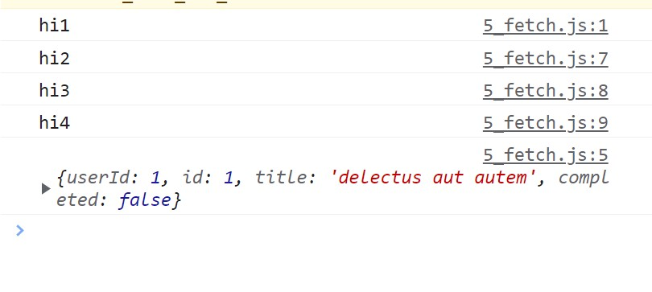

# How Javascript & Browser Works 

## 38.1  Module Intro & How internet Works  

<br>

## 38.2  DOM Treee, Render tree 

<br>

## 38.3  JavaScript v8 engine

<br>

## 38.4  setTimeout simple Asynchronous JS using

**setTimeout();**  
If we call a function using setTimeout(), it will be asynchronus. That means that function will be executed after the execution of all other codes. 

```js

function greeting(){
    console.log(`I am Rajo`);
}


console.log("First Item");
console.log("Second Item");
greeting(); //function called after second item
console.log("Third Item");
console.log("Fourth Item");

// using setTimeout() method to make asynchronus
setTimeout(greeting, 1000); // executed last
setTimeout(greeting); //executed 3rd last

setTimeout(()=>{
    console.log("using arrow function inside setTimeout()")
}); //executed 2nd last depending on the time in milli second

console.log("Fifth Item");
console.log("Sixth Item");
console.log("Seventh Item");
console.log("Eighth Item");
```

<br>

## 38.5  Recognize fetch as an Asynchronous activity  

> Fetch works as asynchronus. 

```js
console.log("hi1");

fetch('https://jsonplaceholder.typicode.com/todos/1')
  .then(response => response.json())
  .then(json => console.log(json))

console.log("hi2");
console.log("hi3");
console.log("hi4");
```

Output:  
  

Notice carefully that though we used `fetch` before `console.log("hi2")`, it executed after all other tasks. Therefore, fetch works in asynchronus way.


## 38.6 setInterval and clearInterval with x++ and ++x  

setInterval() method is used to execute a function again and again after a certain interval


```js
function greeting(){
    console.log(`I am Rajo`);
}
setInterval(greeting,1000);
```